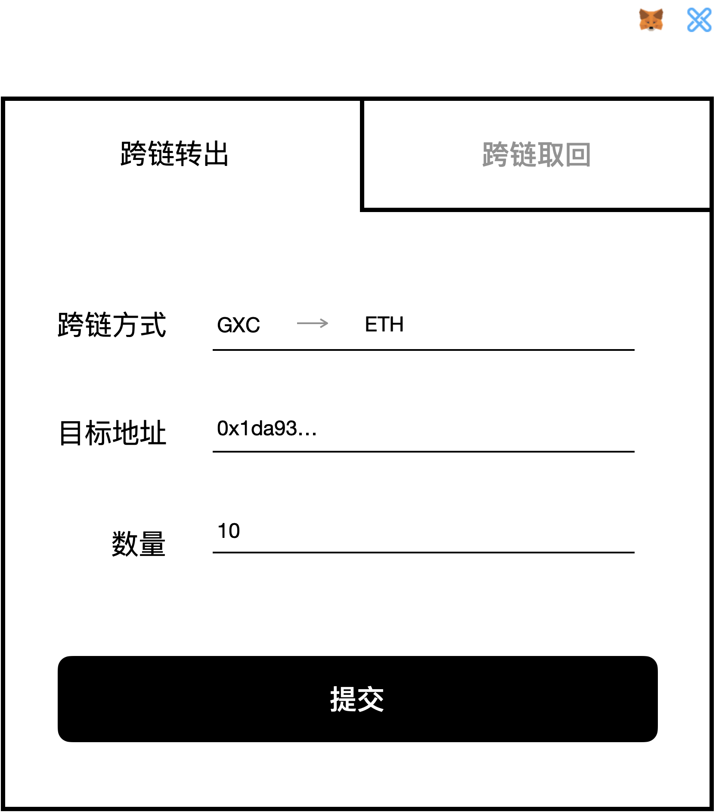
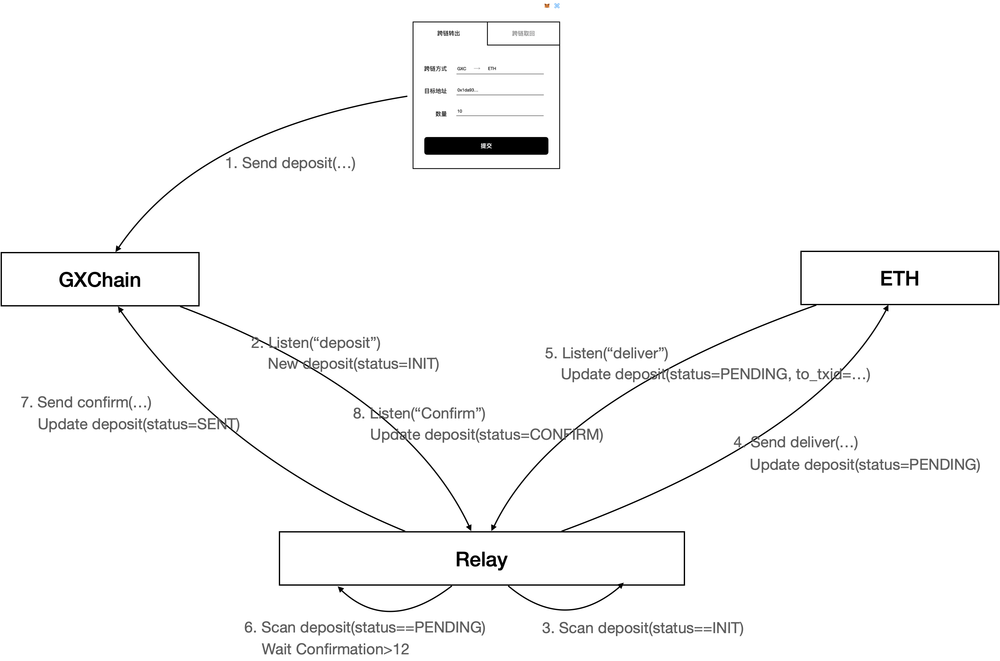
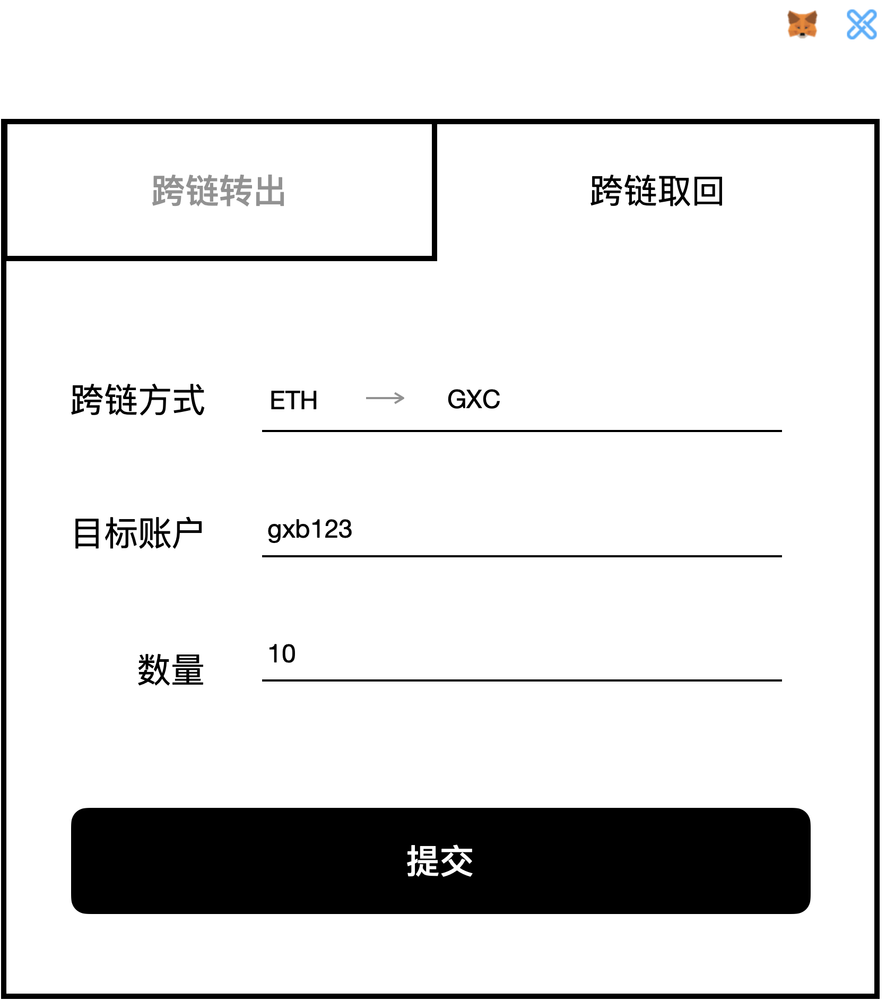
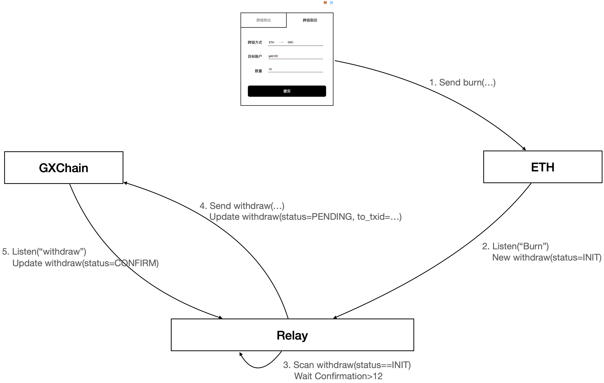

## GXChain 跨链中继

### 简介

GXChain 跨链中继初步的目的是让 GXChain 上的资产可以通过中继进入以太坊、EOS、Cosmos、Polkadot 等热门项目，转换成其它链上的标准资产，如兑换成以太坊的 ERC20，或 EOS 上的用户发行资产，从而使用 GXC 体验以太坊和 EOS 上的 DAPP，或者兑换成 Cosmos 和 Polkadot 平行链上的资产，从而体验 Cosmos 和 Polkadot 的生态应用。GXChain 跨链中继包含以下几个部分：

1. GXChain 上的跨链中继合约
2. 在以太坊、EOS、Cosmos、Polkadot 等同构异构的生态中分别实施的外部中继合约
3. 面向用户的交互界面
4. 中继服务

### 1. 跨链中继合约

#### 参与者

- 用户（User）
- 中继服务（Owner）

#### 行为

o##### 跨链转出

用户通过指定目标链和目标地址，转入相应资产

```C++
PAYABLE deposit(std::string target, std::string addr){
  // assert is (asset) match (target, addr)
  // assert is (target) available
  // create order(target,addr,amount,asset)
}
```

中继服务在监听到用户跨链转出操作后，执行以下操作：

- 在目标链的外部中继合约上调用`deliver`操作，向用户指定的地址发行指定数量资产
- 获取外部中继合约调用的 txid

##### 转出确认

中继服务会不断获取最新的 order 记录，对新的记录进行队列处理，向指定的链发起`deliver`操作，在`deliver`成功后，把该交易的 txid 和 order 的信息作为参数，发送到跨链中继合约，对订单进行确认

```c++
ACTION confirmd(uint64_t order_id, std::string target, std::string addr, uint64_t amount, uint64_t asset){
  // assert is valid sender
  // assert is (order_id,target,addr,amount,asset) match (order)
  // remove order(order_id)
}
```

##### 跨链转回请求

中继服务监听到用户在对应目标链上的取回（销毁）操作时，发起用户取回请求操作，出于安全考虑，请求不会立即执行，而是会将请求信息和当前区块时间入表，需要 24 小时等待时间。

```C++
ACTION withdraw(std::string account,asset std::string, uint64_t amount,std::string from_target, std::string txid){
  // assert is valid sender
  // assert is (account) exist
  // assert is (asset) exist
  // assert is (amount) legal
  // transfer(account, asset, amount)
}
```

##### 取回确认

中继服务将监听取回表中的内容，定时地同意取回表中已经达成的 24 小时确认请求，将取回操作完成。

```C++
ACTION comfirmw(){
  // assert is valid sender
  // assert is (withdraw) exist
  // assert the time is arrival
}
```

### 2. 外部中继合约

#### 参与者

- 用户（User）
- 中继服务（DELIVER_ROLE）

#### 行为

##### 预分发

合约拥有者先将一定数量的 token 发送给中继服务代表的 DELIVER_ROLE,之后由 DELIVER_ROLE 来分发 GXC 资产。

##### 转出/发行

中继服务在 GXChain 上监听到用户跨链转出操作时，调用发行接口`deliver`来向指定地址分发 GXC 资产，以 Mintable-ERC20 为例

```js
event Deliver(address indexed to, uint256 amount, string from, string txid);

function deliver(
        address to,
        uint256 amount,
        string memory from,
        string memory txid
        ) public {
// asset is vaild DELIVER_ROLE
// deliver the ERC20
}
```

##### 取回/销毁

用户可以通过销毁资产，同时指定 GXC 上的地址，实现资产跨链回到 GXChain，以 Burnable-ERC20 为例

```js
event Burn(address indexed from, uint256 amount, string to);
function burn(
        uint256 amount,
        string memory to
        ) public {
// asset the vaild number
}

```

##### 修改最小的发行/销毁的数量

合约的拥有者可以修改单次分发和销毁的最小数量

```js
function adjustParams(
        uint256 minDeliver,
        uint256 minBurn
        ) public {
// adjust the minnumber
}
```

##### 其他

其他接口遵循外部链的标准转账和交互协议

### 3. 交互界面

#### 跨链转出



- 跨链方式：两个单选框，左边展示 GXChain 资产列表，右边展示跨链目标资产列表

- 目标地址(文本)：输入目标链的地址/账户
- 数量(Number)：输入转账数量
- 提交操作：通过 gcatter 调用 client.callContract("relay-contract","deposit",{target:...,addr:...},"10 GXC",true)

**交互流程**



#### 跨链取回



- 跨链方式：两个单选框，左边展示跨链目标资产列表，右边展示 GXChain 资产列表

- 目标账户(文本)：输入 GXC 账户地址，默认展示 gscatter 登录的 gxc 地址
- 数量(Number)：输入跨链转账数量
- 提交操作：根据选定的目标链完成登录提示，使用目标链的插件（如 metamask）调用目标合约的`burn`方法完成目标链资产销毁(转回 gxc 主链)

**交互流程**



#### 其他

- 实时展示最近跨链记录：动态表单|弹幕
- 实时展示当前转出订单的处理状态
- 实时展示当前取回订单的处理状态
- 图表展示转入转出统计等信息

### 4. 中继服务

#### 转出监听

- 监听 gxchain 跨链中继合约的`deposit`操作
- 向目标链发起`deliver`操作
- 等待`deliver`操作完成，将`deliver`操作对应的 txid 和订单信息作为参数，调用 gxchain 跨链中继合约的`confirmd`方法

#### 取回监听

- 监听目标链上的`burn`事件
- 等待`burn`完成，将`burn`操作对应的(txid,amount,gxcAccount)作为参数，调用 gxchain 跨链中继合约的`withdraw`方法
- 每隔一段时间,调用`confirmw`方法，完成`withdraw`中满足时间需求的 withdraw 请求。

#### 应用接口

##### WebSocket 接口

- 订阅最近交易，在获取到新的交易后，向客户端推送订单信息（type,target,addr,amount）

##### HTTP 接口

- 获取最近交易列表
- 获取账户转出记录
- 获取账户取回记录
